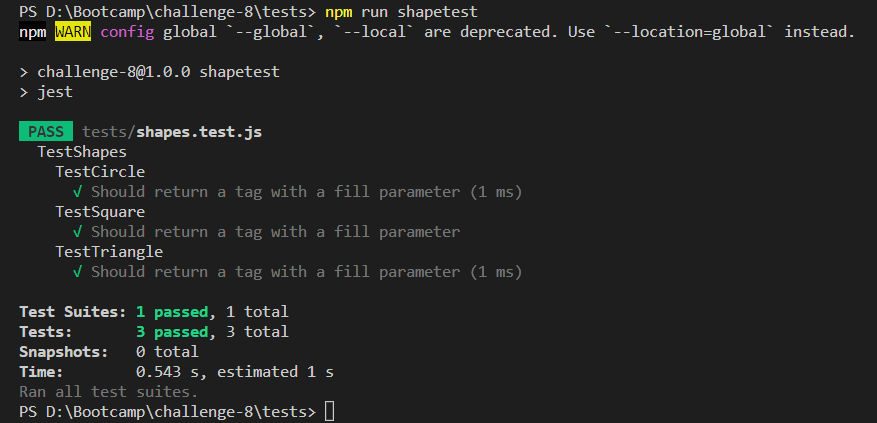

# SVG Logo Generator <!-- omit in toc -->

## Table of contents <!-- omit in toc -->

- [Description](#description)
- [Usage](#usage)
- [Mock Up](#mock-up)
- [Credits](#credits)
- [License](#license)
- [Links](#links)

## Description
**Note: This application runs in the CLI**

Generate a simple logo with a SVG file format. This application accepts inputs for text (No longer than 3 characters), text and background color (this property accepts both color name inputs and HEX code values) and shape (square, circle, triangle).

## Usage
**Note: In order to use this application, you need to install Node.js version 16, npm inquirer version 8.2.4, and the latest versions of jest and colornames.**

In order to start this application, open the CLI (Command Line Interface) and type `node index.js`. This will start a series of questions asking for information about the text content, text and background color fill, and logo shape. 

If all questions are answered successfully, a message will appear confirming the creation of the SVG file and indenting the SVG file in the Examples folder.

## Mock Up

### Start of CLI application <!-- omit in toc -->

### All prompts answered <!-- omit in toc -->

### File append to directory <!-- omit in toc -->

### Example of generated SVG file <!-- omit in toc -->

### Preview of generated SVG file <!-- omit in toc -->

### Showcase of testing suite <!-- omit in toc -->

--- 

## Credits
- Code by: Daniel Sanchez (https://github.com/Morkendi)

## License

This project utilizes an [MIT License](https://choosealicense.com/licenses/mit/)

## Links
- Link to GitHub repo: (https://github.com/Morkendi/SVG-Maker)
- Link to Video Demo: (https://drive.google.com/file/d/1DEbTwl33-_zKfdBbrTEmGVVDk0szRO-4/view?usp=drive_link)